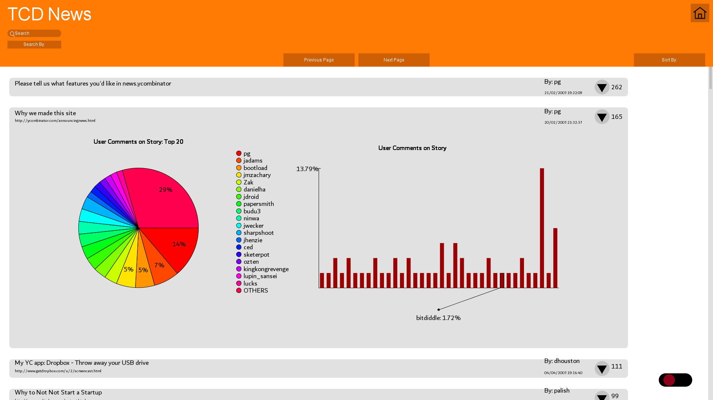

# processing-tcd-news


An application which visualises the public Hacker News dataset using the Processing library in Java. The application resembles a website which displays the dataset in a fun and interesting way.

## Getting Started
### Prerequisites
You need to have installed [Processing Development Environment (PDE)](https://processing.org/download/)

### Installing
1. Clone the github project
  ```
  git clone https://github.com/lexesjan/processing-tcd-news.git
  ```
2. Open the Project folder and double click the Project.pde file

## Documentation
[How the program works](docs/documentation.md)

## Authors
* **Lexes Jan Mantiquilla** - *Most of back-end and some front-end*
* **Eoin Pinaqui** - *Front-end and some back-end*
* **Conall Tuohy** - *Front-end*
* **Gregory Partridge** - *Front-end*
